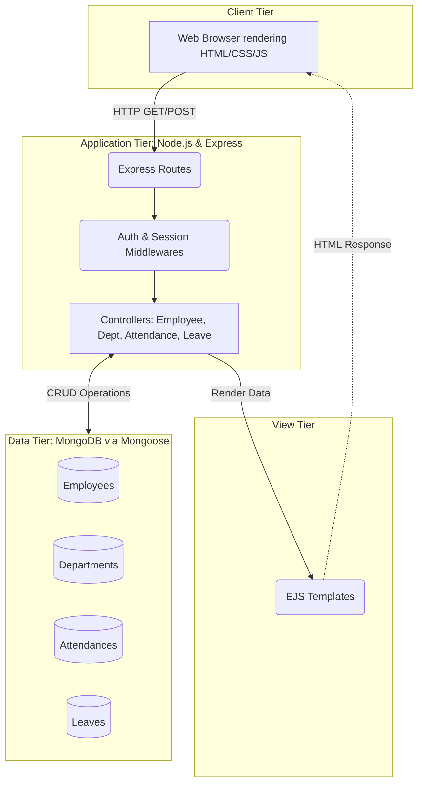
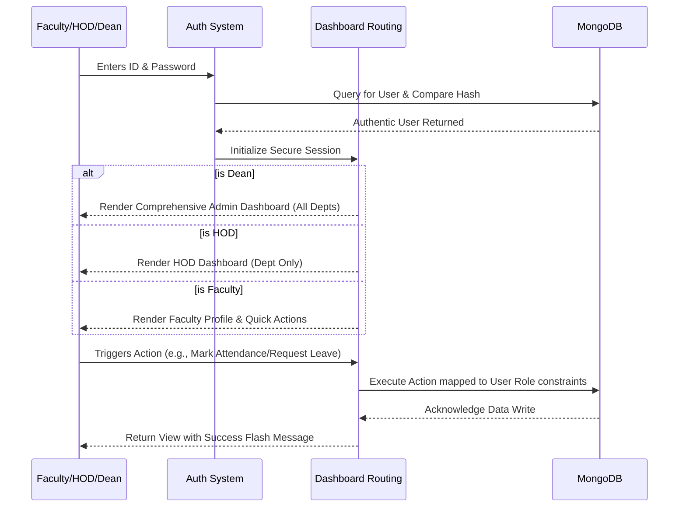

# 🎓 Project Proposal: Employee Management System (EMS)

## CHAPTER 1: INTRODUCTION
The **Employee Management System (EMS)** is a comprehensive web-based application designed to streamline the administrative and human resource operations within academic institutions. Educational organizations often face challenges managing faculty profiles, attendance tracking, departmental assignments, and leave requests. The EMS seeks to replace legacy manual procedures by providing an interactive digital platform. Powered by a modern technology stack—Node.js, Express, and MongoDB—the system isolates actions based on a robust Role-Based Access Control (RBAC) model encompassing Deans, Heads of Departments (HODs), and general Faculty members. The application ensures secure, transparent, and immediate access to centralized organizational data.

## CHAPTER 2: PROBLEM STATEMENT
Traditional methods of managing employee records in educational institutions rely heavily on manual paperwork, fragmented communication logic, or disconnected spreadsheets. This environment cultivates several critical challenges:
1. **Data Redundancy & Inconsistency:** Maintaining employee records on separate spreadsheets increases the risk of conflicting information.
2. **Inefficient Attendance Tracking:** Manual registers are prone to errors and consume valuable administrative hours for tallying monthly payroll data.
3. **Lack of Role-Based Security:** Spreadsheets restrict granular security. Faculty members cannot have isolated views of their data while administrators retain global viewing rights.
4. **Time-Consuming Approvals:** Manual leave request applications suffer from delayed processing and lack transparency.

## CHAPTER 3: LITERATURE REVIEW
1. **Traditional Record Systems:** Historically, colleges have relied on physical registers and files. While completely secure from digital breaches, they suffer from high physical depreciation factors, lack of searchability, and immense storage constraints.
2. **Modern ERP Solutions:** Large-scale systems such as SAP ERP or Oracle HRMS provide heavy-duty operations. However, for a single educational institution, these frameworks are overwhelmingly complicated, require massive institutional adoption efforts, and incur severe subscription costs.
3. **Proposed Custom Solution:** The proposed EMS represents a lightweight, highly specific, and dynamically adaptable alternative. By utilizing web technologies and NoSQL schemas (MongoDB), the project strikes the optimum balance between performance, usability, and low deployment cost. 

## CHAPTER 4: SYSTEM DESIGN

The system uses a classic Model-View-Controller (MVC) software architectural pattern. 

### Architecture Components:
- **Client Tier**: Renders the User Interface dynamically compiled by the server. It handles form submissions and client-side verifications.
- **Application Tier (Server)**: Node/Express forms the backbone, intercepting client requests, utilizing `express-session` for state, routing logic, and connecting components.
- **Data Tier**: MongoDB collections natively storing JSON-like documents, mapping schema properties tightly to Mongoose models.

## CHAPTER 5: PROPOSED WORK MODEL

The proposed working model is based on an interactive workflow strictly respecting authorization boundaries.

### Module Workflow Summary:
1. **Authentication**: Users authenticate using Employee IDs and `bcrypt` hashed passwords.
2. **Dashboard Isolation**: The system routes users to completely different UI constructs limiting operations based strictly on the user level (e.g. Dean, HOD, Faculty).
3. **Service Interaction**: Secure APIs facilitate adding members, altering leave statuses, checking the team's attendance status, and calculating the monthly salary outcomes.

## CHAPTER 6: TECHNOLOGY STACK

### Hardware Requirements
- **Server Environment:** 
  - Dual-core Processor (minimum)
  - 4GB RAM minimum (8GB recommended for scaling)
  - 50GB SSD space 
  - (System is containerizable and can be hosted efficiently on cloud instances like AWS EC2 T2.micro).
- **Client End (End User):** 
  - Any standard device (PC, Tablet, Smartphone) capable of running a modern web browser.

### Software Requirements
- **Frontend Environment**: HTML5, CSS3 (Custom Design System), JavaScript, EJS (Embedded JavaScript templating engine).
- **Backend Environment**: 
  - Node.js (v18.x or above)
  - Express.js (v4.x framework)
- **Database Application**: 
  - MongoDB (Locally hosted or Atlas Cloud implementation)
  - Mongoose ODM (for schema structuring and validation)
- **Application Packages / Libraries**: 
  - `express-session` (Access management)
  - `bcrypt` (Cryptographic password hashing)
  - `json2csv` (Report generation utilities)
  - `dotenv` (Environment configurations)
- **IDE & Development**: Visual Studio Code, Git.

## CHAPTER 7: FUTURE WORK
While the system is robust for its current scope, future continuous integration paradigms highlight several upcoming features:
- **Mobile API Layer**: Establishing RESTful lightweight endpoints serving JSON data exclusively to allow integration with a native mobile application (React Native / Flutter).
- **JWT Refactor**: Shifting from session-based memory architecture to scalable JSON Web Tokens (JWT) for stateless authentication.
- **Notification Services**: Integrating Email capabilities using Nodemailer to dispatch confirmation pings on leave approvals and account generations.
- **Bulk Import Solutions**: Admin interfaces configured to read CSV inputs seamlessly adding 100+ employees instantaneously per department.
- **Advanced BI Analytics**: Expanding administrative views to implement complete Business Intelligence dashboards generating visual Chart.js models on historical salary vs. attendance metrics.

## REFERENCES
1. Express.js Documentation / Guides. Available at: [https://expressjs.com/](https://expressjs.com/)
2. MongoDB Node.js Driver Documentation. Available at: [https://www.mongodb.com/docs/drivers/node/current/](https://www.mongodb.com/docs/drivers/node/current/)
3. "Node.js Design Patterns" - Mario Casciaro & Luciano Mammino (Architecture paradigms mapping).
4. EJS (Embedded JavaScript) Templates. Available at: [https://ejs.co/](https://ejs.co/)
